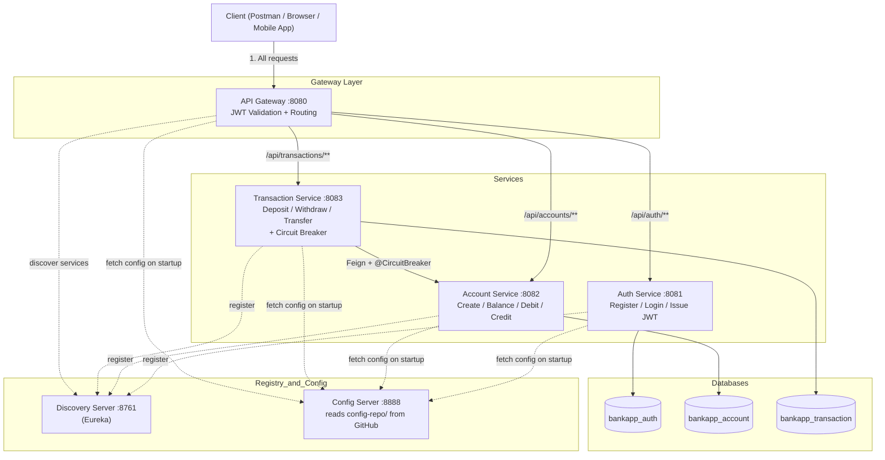
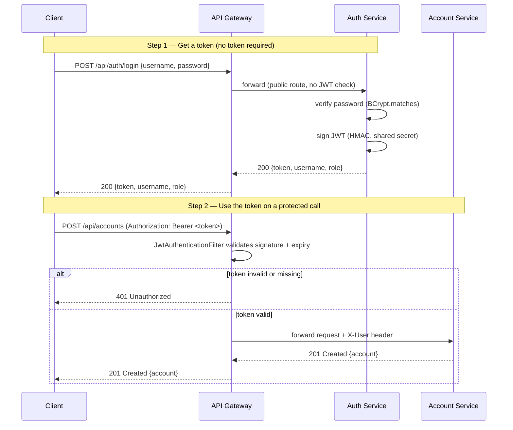
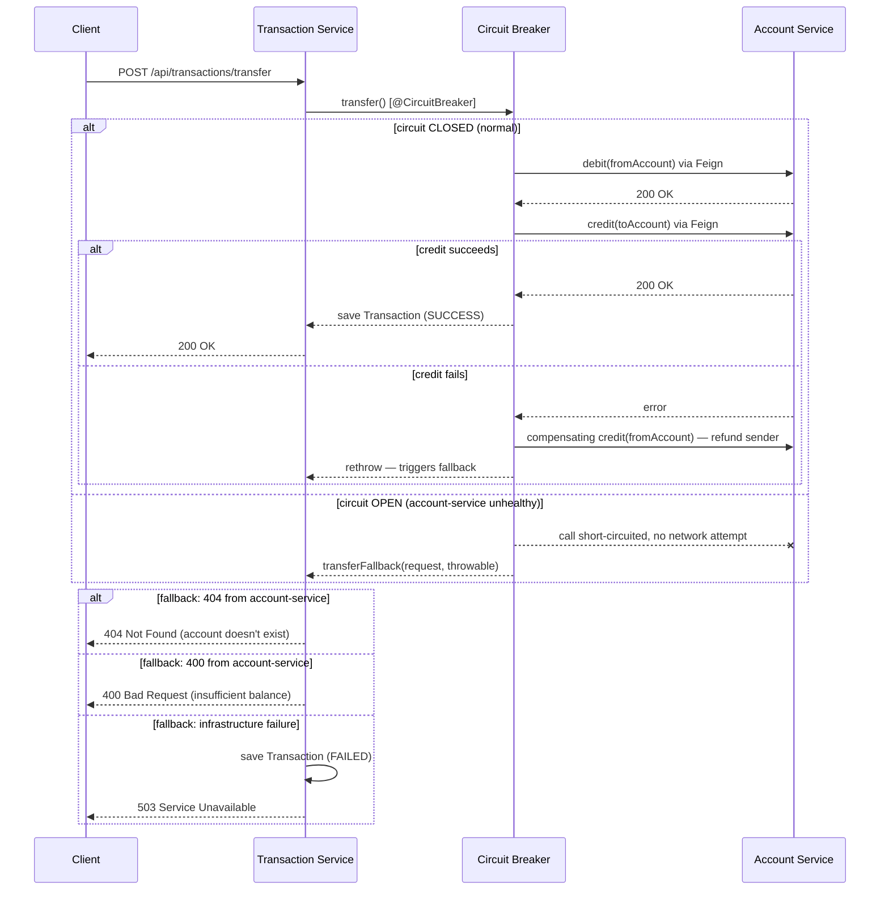
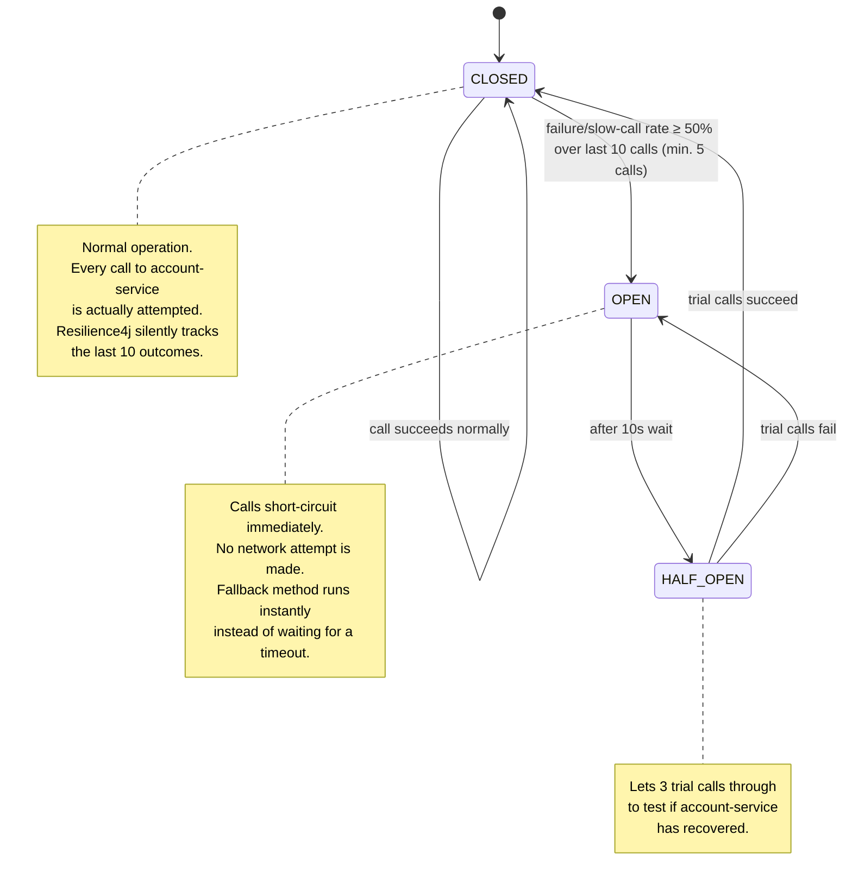

# Banking Application — Spring Boot Microservices

A banking system built from scratch as independent Spring Boot microservices, with JWT-based authentication at the gateway layer and a Resilience4j circuit breaker protecting inter-service calls.

Built as a hands-on learning project — every line was written and understood service by service, not generated wholesale. See [What I Learned](#what-i-learned) for the concepts this project actually covers.

---

## Table of Contents

- [Overview](#overview)
- [Architecture](#architecture)
- [Services](#services)
- [Request Flow: JWT Authentication](#request-flow-jwt-authentication)
- [Request Flow: Money Transfer with Circuit Breaker](#request-flow-money-transfer-with-circuit-breaker)
- [Circuit Breaker State Machine](#circuit-breaker-state-machine)
- [Tech Stack](#tech-stack)
- [Prerequisites](#prerequisites)
- [Running the Project](#running-the-project)
- [API Reference](#api-reference)
- [Database Design](#database-design)
- [Design Decisions Worth Knowing](#design-decisions-worth-knowing)
- [What I Learned](#what-i-learned)
- [Known Limitations & Next Steps](#known-limitations--next-steps)

---

## Overview

Instead of one monolithic Spring Boot app, this system is split into six independently deployable services, each owning its own database (where it has one):

| Service | Responsibility | Port | Own Database |
|---|---|---|---|
| **discovery-server** | Service registry (Eureka) — every service registers here so others can find it by name instead of a hardcoded IP | 8761 | — |
| **config-server** | Centralized configuration — every service's `application.yml` (ports, DB credentials, JWT secret, Resilience4j thresholds) lives in one place and is fetched over HTTP at startup, instead of being duplicated across each service's own files | 8888 | — |
| **api-gateway** | Single entry point for all client traffic. Validates JWTs, routes requests to the right service | 8080 | — |
| **auth-service** | User registration/login, password hashing, JWT issuing | 8081 | `bankapp_auth` |
| **account-service** | Account creation, balance, debit/credit, optimistic locking | 8082 | `bankapp_account` |
| **transaction-service** | Deposits, withdrawals, transfers — calls account-service via Feign, protected by a circuit breaker | 8083 | `bankapp_transaction` |

**Why split it up at all?** In a monolith, a bug in "transactions" code can crash the whole application — including login. Here, if transaction-service goes down, people can still log in and check balances. Each service scales, fails, and deploys independently. That independence is also *why* microservices need things a monolith never worries about: service discovery, an API gateway, and resilience patterns like circuit breakers — because now services talk to each other over an unreliable network instead of a simple in-process method call.

---

## Architecture



**Solid arrows** = real request traffic. **Dashed arrows** = Eureka service discovery / Config Server lookups (registration, config fetch, and name resolution — not business data).

---

## Services

### 1. Discovery Server (Eureka)
Every other service registers itself here on startup (`spring.application.name`, e.g. `account-service`, becomes `ACCOUNT-SERVICE` in the registry). The gateway and Feign clients look services up **by name**, never by hardcoded host:port — so a service can move, restart, or scale to multiple instances without anything else needing to change.

### 2. Config Server
Centralizes configuration that would otherwise be duplicated and error-prone to keep in sync — most importantly the `jwt.secret`, which **must** be identical between auth-service (which signs tokens) and api-gateway (which verifies them). Each service's full config lives as one YAML file (e.g. `auth-service.yml`) inside a `config-repo/` folder in this same GitHub repo. Config Server clones that repo (`spring.cloud.config.server.git.uri`, `search-paths: config-repo`) and serves each file over HTTP at `GET /{service-name}/default`. Every other service keeps only a minimal local `application.yml` — just its `spring.application.name` and `spring.config.import: optional:configserver:http://localhost:8888` — and fetches everything else from here at startup. The `optional:` prefix means a service still starts on its bare-minimum local config if Config Server happens to be unreachable, rather than failing outright.

### 3. API Gateway
The only service clients talk to directly. Built on Spring Cloud Gateway. A `JwtAuthenticationFilter` (a `GlobalFilter`) runs on every request:
- Requests to `/api/auth/register` and `/api/auth/login` pass through untouched (you can't require a token to get your first token).
- Every other request must carry `Authorization: Bearer <token>`. The filter validates the signature and expiry; on success it forwards the username downstream via an `X-User` header, so account-service and transaction-service know who's calling without re-parsing the JWT themselves.
- Routes requests to the right service by path prefix (`/api/auth/**`, `/api/accounts/**`, `/api/transactions/**`), resolving the target via Eureka (`lb://ACCOUNT-SERVICE`, not a fixed URL).

### 4. Auth Service
Handles `POST /api/auth/register` and `POST /api/auth/login`. Passwords are hashed with **BCrypt** before ever touching the database — the raw password is never stored. On success, issues a JWT signed with HMAC-SHA, containing the username (`sub`) and role as claims. Duplicate username/email checks return `409 Conflict`; failed login returns a **generic** `401` for both "user doesn't exist" and "wrong password," so the API can't be used to enumerate valid usernames.

### 5. Account Service
Owns account data — `POST /api/accounts` (create), `GET /api/accounts/{accountNumber}`, and internal `PUT /{accountNumber}/debit` / `/credit` endpoints (called by transaction-service, not customers directly). Balances use `BigDecimal`, never `double`/`float` — floating-point types can't exactly represent decimal fractions, and for money that's unacceptable. Every `Account` has a `@Version` field enabling **optimistic locking**: if two requests try to update the same account concurrently, the second one's stale-version update is rejected rather than silently overwriting the first (preventing a classic "lost update" bug).

### 6. Transaction Service
The most involved service. `POST /api/transactions/deposit|withdraw|transfer` each call account-service through a **Feign client**, wrapped in a **Resilience4j `@CircuitBreaker`**. Every attempt — successful or failed — is recorded as an immutable `Transaction` row (an audit log, never updated in place, only ever inserted). See the sections below for exactly how this works.

---

## Request Flow: JWT Authentication



The core idea: login is how you prove identity *once*, with a password. The JWT it returns is what you present on every subsequent call, instead of resending credentials. The gateway is the only place that checks the token — downstream services trust the gateway already did that job (a simplification noted in [Known Limitations](#known-limitations--next-steps)).

---

## Request Flow: Money Transfer with Circuit Breaker



**Two failure categories are deliberately handled differently:**
- **Business errors** (account not found, insufficient balance) return the correct `404`/`400` and are *excluded* from the circuit breaker's failure-rate calculation — a customer mistyping an account number shouldn't help trip the circuit for everyone else.
- **Infrastructure failures** (account-service down, slow, unreachable) return `503`, get logged as a `FAILED` transaction for audit purposes, and *do* count toward tripping the circuit.

**Compensating transaction:** if the debit succeeds but the credit leg fails, the code automatically re-credits the sender — a simple saga-style compensation so a partial failure doesn't leave money debited from one account and never credited anywhere.

---

## Circuit Breaker State Machine



Configuration (`transaction-service/application.yml`):

| Setting | Value | Meaning |
|---|---|---|
| `sliding-window-size` | 10 | Look at the last 10 calls to decide health |
| `minimum-number-of-calls` | 5 | Don't evaluate failure rate until at least 5 calls have happened |
| `failure-rate-threshold` | 50% | Open the circuit if ≥50% of the window failed |
| `slow-call-duration-threshold` | 2s | A call taking longer than this counts as "slow" |
| `slow-call-rate-threshold` | 50% | Open the circuit if ≥50% of calls are slow, even if they "succeed" |
| `wait-duration-in-open-state` | 10s | Stay OPEN this long before trying HALF_OPEN |
| `permitted-number-of-calls-in-half-open-state` | 3 | Trial calls allowed through in HALF_OPEN |

---

## Tech Stack

- **Java 21**, **Spring Boot 4.1.0**, **Spring Cloud 2025.1.2**
- **Spring Web** — REST controllers
- **Spring Data JPA** + **Hibernate** — persistence, one MySQL database per service
- **Spring Security** (auth-service only) — BCrypt password hashing
- **jjwt 0.12.6** — JWT signing/parsing
- **Spring Cloud Netflix Eureka** — service discovery
- **Spring Cloud Config Server** (git-backed) — centralized configuration, reading `config-repo/` from this repo on GitHub
- **Spring Cloud Gateway** — API gateway, reactive filter-based routing
- **Spring Cloud OpenFeign** — declarative HTTP client for service-to-service calls
- **Resilience4j** (via `spring-cloud-starter-circuitbreaker-resilience4j`) — circuit breaker
- **Spring Boot Actuator** — health/circuit-breaker state inspection
- **Lombok** — boilerplate reduction (`@Data`, `@Builder`, `@RequiredArgsConstructor`)
- **MySQL 8**

---

## Prerequisites

- Java 21
- Maven (or use the included `mvnw` wrapper)
- MySQL 8 running locally on `3306` (default credentials `root`/`root` — sourced from `config-repo/*.yml`, override there if different)
- Internet access on first config-server startup, to clone this repo's `config-repo/` folder from GitHub
- IntelliJ IDEA (or any IDE) — each service is a separate Maven module

## Running the Project

Databases are auto-created on first connection (`createDatabaseIfNotExist=true`) — no manual `CREATE DATABASE` needed. Configuration for every service (ports, DB credentials, JWT secret, Resilience4j thresholds, gateway routes) lives in [`config-repo/`](./config-repo) in this same repo, served by `config-server` at runtime — see [Config Server](#2-config-server) above.

**Start order matters** — `config-server` and `discovery-server` must be up before anything that depends on them:

1. `discovery-server` — wait until `http://localhost:8761` loads
2. `config-server` — verify it's serving config, e.g. `http://localhost:8888/auth-service/default` should return JSON
3. `auth-service`
4. `account-service`
5. `transaction-service`
6. `api-gateway`

Verify all five application services (auth, account, transaction, gateway, and config-server itself) show up under "Instances currently registered with Eureka" at `http://localhost:8761`.

## API Reference

All client traffic goes through the gateway at `http://localhost:8080`.

| Method | Endpoint | Auth required | Description |
|---|---|---|---|
| POST | `/api/auth/register` | No | Create a user, returns a JWT |
| POST | `/api/auth/login` | No | Authenticate, returns a JWT |
| POST | `/api/accounts` | Yes | Open a new account |
| GET | `/api/accounts/{accountNumber}` | Yes | Fetch account details |
| GET | `/api/accounts/user/{username}` | Yes | List a user's accounts |
| POST | `/api/transactions/deposit` | Yes | Deposit into an account |
| POST | `/api/transactions/withdraw` | Yes | Withdraw from an account |
| POST | `/api/transactions/transfer` | Yes | Transfer between two accounts |

Example — register, then create an account:
```bash
curl -X POST http://localhost:8080/api/auth/register \
  -H "Content-Type: application/json" \
  -d '{"username":"bhavesh","email":"bhavesh@example.com","password":"secret123"}'

curl -X POST http://localhost:8080/api/accounts \
  -H "Authorization: Bearer <token from above>" -H "Content-Type: application/json" \
  -d '{"ownerUsername":"bhavesh","accountType":"SAVINGS","initialDeposit":1000}'
```

### Postman Collection

A ready-to-import Postman collection and environment live in [`postman/`](./postman) — every endpoint in the API Reference table above, pre-built:

- `postman/Banking-App.postman_collection.json`
- `postman/Banking-App.postman_environment.json`

**To use:**
1. Import both files into Postman
2. Select the **Banking App** environment (top-right dropdown)
3. Run **Login User** once — its post-response script (`pm.environment.set("token", response.token)`) automatically saves the returned JWT into the environment's `token` variable
4. Every other protected request is already configured with **Authorization → Bearer Token → `{{token}}`**, so it authenticates automatically — no manual copy-pasting of tokens between requests. Just re-run Login when the token expires (1 hour, per `jwt.expiration-ms`).

## Database Design

Each service owns a completely separate MySQL database — no shared tables, no cross-database foreign keys:

- **`bankapp_auth.users`** — `id`, `username` (unique), `email` (unique), `password` (BCrypt hash), `role`, `created_at`
- **`bankapp_account.accounts`** — `id`, `account_number` (unique, generated), `owner_username` (soft reference, not a foreign key), `account_type`, `balance` (`DECIMAL(19,2)`), `status`, `version` (optimistic lock), `created_at`
- **`bankapp_transaction.transactions`** — `id`, `type`, `from_account_number`, `to_account_number`, `amount`, `status`, `failure_reason`, `timestamp` — an append-only audit log; rows are never updated, only inserted, including failed attempts

`accounts.owner_username` deliberately does **not** reference `users` as a real foreign key — it can't, since `users` lives in a different database owned by a different service. This is a genuine microservices tradeoff: giving up referential integrity in exchange for true service independence.

## Design Decisions Worth Knowing

- **`BigDecimal` for all money fields** — never `double`/`float`, which can't represent decimal fractions exactly and would introduce rounding errors unacceptable for currency.
- **Optimistic locking (`@Version`) on `Account`** — protects balances from lost updates when concurrent requests hit the same account, without the cost of pessimistic row-locking.
- **DTOs never expose entities directly** — every service has separate `@Entity` and `*Dto` classes, so internal schema changes don't automatically become breaking API changes.
- **DTOs are duplicated across services, deliberately** — transaction-service has its own copy of `AccountDto`/`BalanceUpdateRequest`, not a shared import from account-service. Services don't share code; they share an HTTP contract. This is the accepted cost of true independent deployability.
- **Centralized exception handling (`@RestControllerAdvice`)** — business exceptions (`AccountNotFoundException`, `InsufficientBalanceException`) are thrown from service-layer code with zero HTTP knowledge; a single `GlobalExceptionHandler` per service maps them to the correct status code, keeping controllers free of `try/catch`.
- **Generic error messages on login failure** — "invalid username or password" for both a nonexistent user and a wrong password, closing a username-enumeration side channel.

## What I Learned

This project was built to understand — not just produce — the following:
- **Service discovery** with Eureka, and why hardcoded service URLs don't work in a system where instances can move/scale
- **JWT-based stateless authentication** — signing, validating, and the tamper-evident (not secret) nature of a JWT payload
- **Declarative HTTP clients with Feign**, and how they compare to manually building `RestTemplate` calls
- **Resilience4j circuit breakers** — the CLOSED/OPEN/HALF_OPEN state machine, sliding windows, slow-call detection, and the difference between failures that should and shouldn't count against a circuit's health
- **Compensating transactions** as a lightweight alternative to distributed transactions across services
- **Optimistic locking** as a concurrency-safety mechanism, and how it differs from pessimistic locking
- Real debugging: a fallback-method name mismatch caught only by tracing the exact string Resilience4j looks up at runtime, and a copy-paste field bug (`toAccountNumber` vs `fromAccountNumber`) caught by reasoning through what the data should actually mean

## Known Limitations & Next Steps

- **No Config Server** — `application.yml` (including the JWT secret) is duplicated across auth-service and api-gateway rather than centralized
- **JWT is trusted, not re-validated, downstream** — account-service and transaction-service trust the gateway's `X-User` header rather than independently verifying the token; a defense-in-depth improvement for a zero-trust internal network
- **No refresh tokens** — only short-lived access tokens currently
- **Compensating transaction has a gap** — if the *reversal* credit call (after a failed transfer credit) itself fails, there's no durable retry; a production system would use an outbox pattern or saga orchestrator instead of a single best-effort inline attempt
- **No Notification Service** — no email/SMS on transaction completion yet
- **No distributed tracing** — would help once debugging cross-service call chains gets harder
- **No Docker Compose** — currently requires manually starting 5 services + MySQL in the right order
